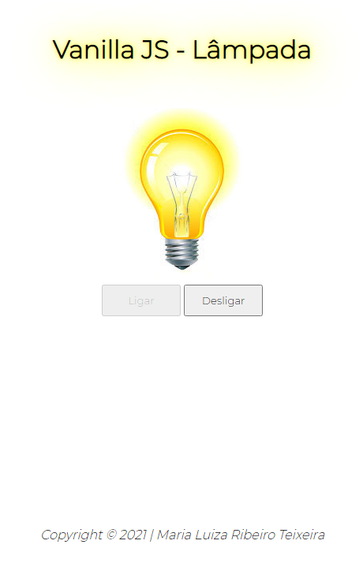
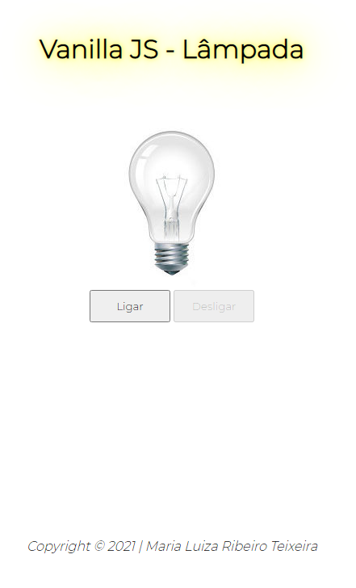
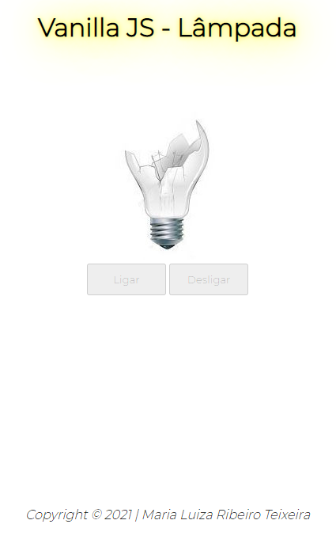

# Lâmpada e seus estados

Projeto criado sob orinetação do professor [Fernando Leonid](https://github.com/fernandoleonid) com o objetivo didático nas aula de Programação Web Front-End, matéria integrante do curso de Desenvolvimento de Sistema do [SENAI](https://jandira.sp.senai.br/)

O projeto consiste em criar uma lâmpada que responde às ações do usuário, como click e sobreposição de mouse. As respostas baseiam-se em:
* Ligar;
* Desligar;
* Quebrar;

Tudo isso foi feito seguindo as boas práticas de prpgramação, como funções com responsabilidade única.

## Resultado:

